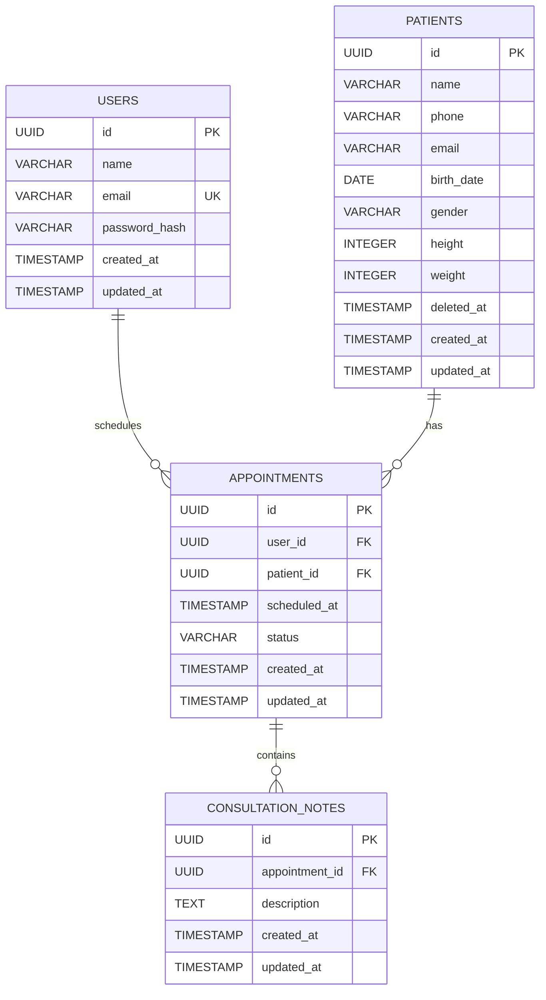

# Documentação do Banco de Dados

# Banco de Dados

O projeto utiliza PostgreSQL como banco de dados relacional.

## Diagrama

## Relacionamentos

- `users` → `appointments`: um usuário pode possuir várias consultas agendadas.
- `patients` → `appointments`: um paciente pode possuir várias consultas.
- `appointments` → `consultation_notes`: uma consulta pode possuir várias observações.

## Regras importantes

A combinação de `user_id` e `scheduled_at` em `appointments` é única, impedindo que o mesmo usuário responsável tenha mais de um paciente agendado no mesmo horário.

A exclusão de pacientes é lógica. O campo `deleted_at` identifica pacientes removidos e os dados pessoais são anonimizados, preservando os relacionamentos necessários para o histórico de consultas.

As medidas são armazenadas como valores inteiros:

- `height`: altura em centímetros.
- `weight`: peso em gramas.